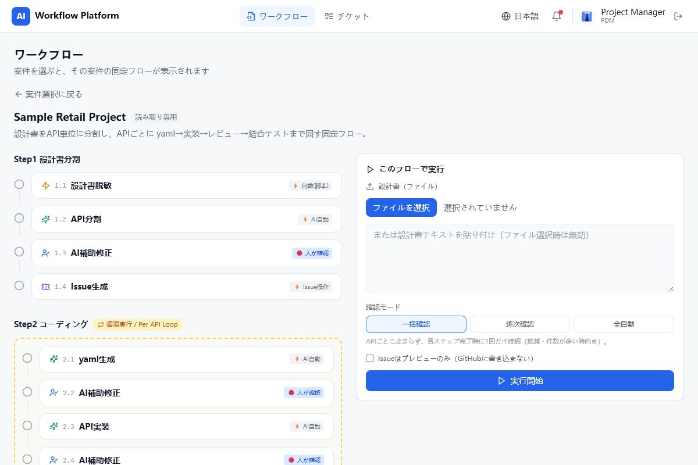
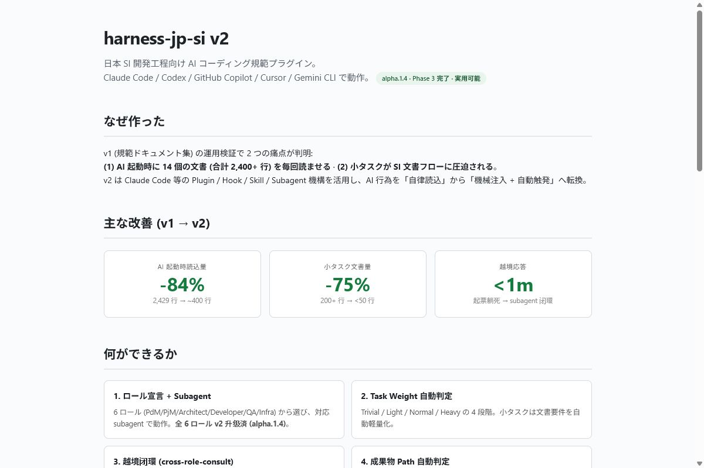

<p align="center">
  
</p>

<div align="center">
  
  <br />
  
  
  
</div>

## 👾 Player profile

```ts
const saigetsu = {
  role: "AI Product Engineer",
  quests: ["workflow automation", "developer tools", "small product experiments"],
  superpower: "turning ambiguity into shippable systems",
  fuel: ["coffee", "curiosity", "fresh powder"],
  rule: "keep humans in control of consequential AI actions",
  status: "building in public 🚀",
};
```

> 我喜欢把模糊的业务流程，炼成可运行、可部署、可验证的软件。  
> 曖昧な業務フローを、実行・検証・改善できるプロダクトへ。

## 🎮 Current quests

<table>
<tr>
<td width="50%" valign="top">
<h3>🤖 <a href="https://github.com/Saigetsu233/ai-workflow-automation">AI Workflow Automation</a></h3>
<p><code>FastAPI</code> <code>React</code> <code>Human approval</code></p>
<p>Turns fuzzy requests into deterministic, reviewable workflows—with AI helping and humans holding the launch key.</p>
<p><a href="https://github.com/Saigetsu233/ai-workflow-automation"><b>Enter the workflow lab →</b></a></p>
</td>
<td width="50%" valign="top">
<h3>🧩 <a href="https://github.com/Saigetsu233/harness-jp-si">Harness JP SI</a></h3>
<p><code>Multi-agent</code> <code>Governance</code> <code>75 checks</code></p>
<p>A six-role delivery harness for AI-assisted Japanese SI projects, complete with review gates and guardrails.</p>
<p><a href="https://github.com/Saigetsu233/harness-jp-si"><b>Inspect the harness →</b></a></p>
</td>
</tr>
<tr>
<td colspan="2" valign="top">
<h3>🚢 <a href="https://github.com/Saigetsu233/freightkit-calculators">ShipMathLab / FreightKit</a></h3>
<p><code>20 live tools</code> <code>Shipping math</code> <code>Embeddable</code></p>
<p>Browser-ready freight calculators and reusable formulas for dimensional weight, pallet loads, and LCL W/M.</p>
<p><a href="https://shipmathlab.com/"><b>Play with the live tools →</b></a></p>
</td>
</tr>
</table>

<details>
<summary><b>🔎 Peek inside the builds</b></summary>
<br />

[](https://github.com/Saigetsu233/ai-workflow-automation)

[](https://github.com/Saigetsu233/harness-jp-si)

[](https://shipmathlab.com/tools/dimensional-weight-calculator)

</details>

## 🧰 Tech inventory

<div align="center">
  
</div>

## 📊 Player stats

<div align="center">
  
  
</div>

<picture>
  <source media="(prefers-color-scheme: dark)" srcset="https://raw.githubusercontent.com/Saigetsu233/Saigetsu233/output/github-snake-dark.svg" />
  <source media="(prefers-color-scheme: light)" srcset="https://raw.githubusercontent.com/Saigetsu233/Saigetsu233/output/github-snake.svg" />
  
</picture>

<details>
<summary><b>🧪 Proof of work</b></summary>
<br />

| Project | What is implemented | Verification |
| --- | --- | --- |
| AI Workflow Automation | React, FastAPI, workflow engine, GitHub/OpenAI integration, human checkpoints | Production frontend build and backend health smoke test |
| Harness JP SI | Six roles, multi-platform bootstrap, hooks, skills, templates, governance rules | 75 structural checks passing |
| ShipMathLab | 20 live tools, guides, SEO pages, public formulas, embeddable calculators | Formula tests passing; live public deployment |

</details>

## 🛰️ Open channel

I am interested in **AI product engineering**, **workflow automation**, **developer tooling**, and full-stack roles where product judgment matters alongside implementation.

For project-specific questions, open an issue in the relevant repository. Pull requests, curious questions, and slightly over-engineered ideas are all welcome. 🛸

<p align="center">
  <i>🏂 Carving through messy workflows, one clean commit at a time.</i>
</p>

<p align="center">
  
</p>

